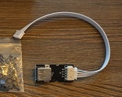

# 6.2 Mellow Super8 V1.3

## Setup guide

Here's A detailed guide on how to install the Mellow Super8 V1.3 with Mellow 5160HV Externals and how to wire everything up.

What's in the boxes

Overview of the board.

## Fuses

The first thing we need to do is install the fuses. These are in one off the small bags and should be put in the board as shown down below.

## Mosfets

Now we're gonna install the Mosfets for the fansports. These are needed otherwise the fanports won't work. The mosfets are in the same small bag the Fuses where in. Don't be afraid to break them in halve they're ment to be.

You'll see that the mosfet ports on the board arrive empty and are in between the fan plugs.

Insert the mosfets into the holes the direction they face doesn't matter.

## Driver setup

Now we're done with that we're going to the plugs for the driver ports. We're gonna install the bridges for SPI and UART.

Here's a view of the board with all the plugs still not filled. It's important to not put bridges on the ports you're not gonna use.

For SPI you need to put bridges on the front 2 rows of pins. These are used for the 5160's

 &nbsp &nbsp 

For UART you need to put the bridge on the second pin from the left and then bridge the front and middle row. These are for the 2209's.

Next step is to populate all the driver slots that you're gonna use. Here's a example for a AWD setup on 5160's and Z and E on 2209's.

## Fan Voltage Selection

Next up we're gonna put the fan ports on the voltage we would like to run them on. You can choose 5V/12V/24V. Each plug has a voltage selection pin grid to the right of it.

The bridges are to be inserted Left to right. The Top row is 5V. Middle row is 12V and the Bottom row is 24V.

## Plugging everything into the board

Now were going into depth what to plug in where on the Motherboard.

Here's a quick overview of how a final setup could look depending on the options you have on your machine.

Here's a pinout for the Motherboard. We're gonna be using this to find where we need to plug in things.

And a closeup of the more important section we're gonna be talking about next.

## Powering the Raspberry Pi

Power for the Raspberry Pi is provided using the included JST to USB-A female adapter.

This adapter plugs in to the CAN port of the motorboard. The CAN port is to the left of the DRIVER7 slot.

After installing the adapter, plug in the USB-A side of the included USB cable. Plug the other end (USB-C) in to the Raspberry Pi's USB-C port.

At last, there is a second USB-A to USB-C cable. This cable connects the motherboard to the Raspberry Pi for data communications. Plug the USB-C end in to the motherboard, and the USB-A end in to the Raspberry Pi.

## Finished product

Once everything is hooked up it might look something like this 

