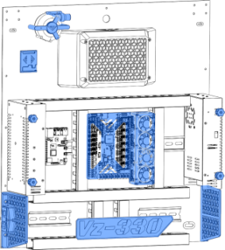

# Laying the parts out

Time has come to put the electronic and electrical components on the back panel of the printer. This will be where the majority of the electronics live and breathe for the foreseeable future. *Let's get started...* 

## The layout

Shown below is the standard and recommended layout for the electronics on the back panel ("electronics bay"). This layout is verified to work, and all kit parts should fit. 

All following descriptions reference the image below for left or right hand side indications.

1. Power supplies left and right
  + (A) The left hand side power supply is the 24V DC power supply (PSU)
  + (B) The right hand side power supply is the 48V DC power supply (PSU)
  + Knobs are placed on the PSU's for affixing the back cover.
2. Power inlet
  + Located on the left hand side
  + Inserted into one of the skirt pieces
3. DIN rail
  + (A) Mounted horizontally and centrally on the back panel
    - Mounting location for PCB's and other electronics
  + (B) Two small sections sit either side of the skirts
    - Mounting location for electrical wiring and junctions
4. Raspberry Pi
  + To the right of the 24V PSU
  + Mounted on the DIN rail
5. Motherboard
  + Central in the electronics bay
  + Mounted on the DIN rail
6. TMC5160HV external stepper driver modules
  + Mounted close to the 48V PSU
  + Next to the motherboard
  + Mounted on the DIN rail
  + Fan bracket sits on these to keep them cool
7. CPAP Fan
  + Mounted top-left
  + Provides the air supply for the printhead part cooling duct
8. CPAP Fan controller
  + Controls the power to the CPAP fan
9. Cable routing channels
  + Tidy up yar cabling ratsnest will ya!
  + Looks pretty schmick

**Deviating from this standard layout may run you into problems.** Choose wisely if you do deviate! Ask for help and share your ideas with other builders. 

## The motherboard

We recommend checking out the Motherboard setup guide first, as it contains steps that are easier to perform while the motherboard is still free to move around.

[Motherboard setup](/vz330_mellow/electronics/motherboard-setup/){.btn .btn-red}

Now we know how the board works a bit we can start setting it up on the machine. Mount the PSU's and Board on the back of the printer in the order you prefer or how it's layed out for the Kit.

## choosing a layout

Here is the layout For the Mellow Vz330 kit. It's important to check if everything fits where you want before attaching it.

